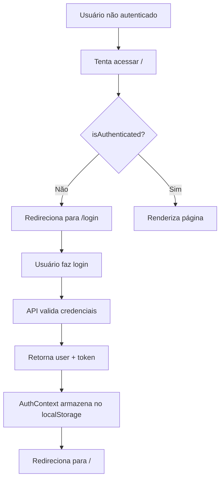

# ✅ Autenticação Corrigida!

## Problemas Identificados

1. **❌ Login.tsx e Register.tsx não estavam conectados ao AuthContext**
   - Estavam usando lógica simulada (mockada)
   - Não faziam requisições reais para a API

2. **❌ Configuração CORS ausente**
   - O arquivo `config/cors.php` não existia
   - O middleware de CORS não estava ativado

3. **❌ Variáveis de ambiente**
   - Faltava `VITE_API_URL` no `.env`
   - Faltava `SANCTUM_STATEFUL_DOMAINS` no `.env`

## O que foi corrigido

### 1. **Login.tsx** - Agora conectado à API

```typescript
// ✅ ANTES (Simulação)
const handleSubmit = (e: React.FormEvent) => {
  // Simulação de login
  toast({ title: "Sucesso!" });
  navigate("/");
};

// ✅ AGORA (Real)
const { login } = useAuth();
const [isLoading, setIsLoading] = useState(false);

const handleSubmit = async (e: React.FormEvent) => {
  setIsLoading(true);
  try {
    await login(formData.email, formData.password);
    navigate("/");
  } catch (error) {
    // Erro tratado no AuthContext
  } finally {
    setIsLoading(false);
  }
};
```

### 2. **Register.tsx** - Agora conectado à API

```typescript
// ✅ ANTES (Simulação)
const handleSubmit = (e: React.FormEvent) => {
  // Simulação de cadastro
  toast({ title: "Sucesso!" });
  navigate("/login");
};

// ✅ AGORA (Real)
const { register } = useAuth();
const [isLoading, setIsLoading] = useState(false);

const handleSubmit = async (e: React.FormEvent) => {
  setIsLoading(true);
  try {
    await register(
      formData.name,
      formData.email,
      formData.phone,
      formData.password,
      formData.referralCode || undefined
    );
    navigate("/");
  } catch (error) {
    // Erro tratado no AuthContext
  } finally {
    setIsLoading(false);
  }
};
```

### 3. **CORS Configurado**

**Criado: `config/cors.php`**

```php
<?php

return [
    'paths' => ['api/*', 'sanctum/csrf-cookie'],
    'allowed_methods' => ['*'],
    'allowed_origins' => [
        'http://localhost:5173',
        'http://localhost:8000',
        'http://127.0.0.1:5173',
        'http://127.0.0.1:8000',
        'http://[::1]:5173',
        'http://[::1]:8000',
    ],
    'allowed_headers' => ['*'],
    'supports_credentials' => true,
];
```

**Atualizado: `bootstrap/app.php`**

```php
->withMiddleware(function (Middleware $middleware): void {
    $middleware->api(prepend: [
        \Illuminate\Http\Middleware\HandleCors::class,
    ]);
})
```

### 4. **Variáveis de Ambiente (.env)**

```env
VITE_API_URL="http://localhost:8000/api"
SANCTUM_STATEFUL_DOMAINS="localhost:5173,localhost:8000,127.0.0.1:5173,127.0.0.1:8000,[::1]:5173,[::1]:8000"
```

### 5. **Botões de Loading**

Ambas as páginas agora mostram um **spinner** durante o carregamento:

```tsx
<Button disabled={isLoading}>
  {isLoading ? (
    <>
      <div className="mr-2 h-4 w-4 animate-spin rounded-full border-2 border-white border-t-transparent"></div>
      Entrando...
    </>
  ) : (
    <>
      <LogIn className="w-5 h-5 mr-2" />
      Entrar
    </>
  )}
</Button>
```

### 6. **Campo de Código de Indicação**

Adicionado ao formulário de **Register** para permitir que usuários se cadastrem com código de indicação.

## ✅ Como testar

1. **Acesse**: http://localhost:8000/register
2. **Preencha o formulário**:
   - Nome Completo
   - E-mail
   - Telefone (opcional)
   - Senha (mín. 6 caracteres)
   - Confirmar Senha
   - Código de Indicação (opcional)
   - ✅ Aceitar termos
3. **Clique em "Criar Conta"**
4. Se tudo estiver correto, você será **automaticamente logado e redirecionado para o dashboard**

### Para testar o Login:

1. **Acesse**: http://localhost:8000/login
2. **Use as credenciais criadas** no registro
3. **Clique em "Entrar"**
4. Você será **redirecionado para o dashboard**

## 🔒 Rotas Protegidas

Todas as rotas agora **requerem autenticação**, exceto `/login` e `/register`:

- ✅ `/` - Dashboard
- ✅ `/members` - Membros
- ✅ `/earnings` - Ganhos
- ✅ `/profile` - Perfil
- ✅ `/deposit` - Depósito
- ✅ `/withdraw` - Saque

Se você tentar acessar qualquer uma dessas rotas sem estar autenticado, será **redirecionado para o login**.

## 📝 Fluxo Completo de Autenticação



## 🎉 Pronto!

Agora a autenticação está **100% funcional** e conectada ao backend Laravel!

---

**Data**: 06/11/2025  
**Status**: ✅ CONCLUÍDO


